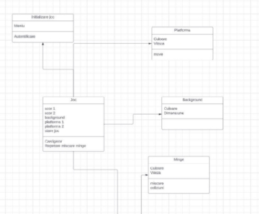

**Tema de proiect** 

1. Titlul proiectului 

Joc Ping-Pong. 

2. De ce ați ales acest proiect? 
- Actualitatea temei: Jocurile de tip ping-pong între 2 persoane sunt destul de populare și apreciate. Chiar dacă jocul are la bază o idee destul de simplă și des folosită, acest proiect va avea elemente unice care vor face diferența între versiunile apărute anterior. 
- Domeniul de aplicabilitate al proiectului: Proiectul poate fi utilizat pentru a învăța programare și a începe o carieră în dezvoltarea de jocuri, sau pur și simplu pentru distracție și divertisment. 
- Potențiali utilizatori: Persoanele dornice să învețe cum se poate recrea un joc clasic, sau cei care doresc să petreacă timp jucându-se cu cineva. 
3. Descrierea proiectului și a rezultatelor propuse a fi realizate? 
- Descriere generală: Proiectul constă în dezvoltarea unui joc de ping-pong, în care doi jucători pot controla platformele pentru a respinge mingea și a obține puncte. Fiecare jucător va avea asociat un cont care va avea salvat scorul împotriva persoanei cu care joacă în acea rundă. De asemenea, se poate selecta gradul de dificultate și diferite modele de platforme. 
- Concepte introduse/utilizate în proiect: Animare, detecție de coliziuni, interacțiunea utilizatorului, gestionarea stării jocului (grad de dificultate, scor, customizare). 
- Arhitectura proiectului: 

  -Arhitectură monolitică: toate componentele și funcționalitățile jocului sunt cuprinse într-un singur singur fișier sau modul. Acest lucru ar include gestionarea interfeței utilizatorului, mișcarea platformelor și a mingii, detectarea coliziunilor, gestionarea scorului, logica jocului și logarea. 

  

- Indicatori de performanță propuși: 

  -**Timpul de livrare**: Respectarea tuturor termenelor propuse ar implica finalizarea proiectului până pe data de 12 decembrie 2023. 

- **Calitatea produsului**: Am în vedere dezvoltarea unui produs de înaltă calitate care să respecte toate cerințele legale și reglementările specifice domeniului. 
- **Satisfacția utilizatorilor**: Un aspect crucial pe care intenționez să-l evaluez prin intermediul unui sondaj asociat modelului beta, și de care voi ține cont înainte de finalizarea aplicației. 
- **Numărul de erori/bug-uri:** Voi înregistra și monitoriza numărul de erori sau bug-uri pe parcursul dezvoltării aplicației. 
- **Performanța hardware:** Proiectul ar trebui să ofere o experiență de joc fluentă, fără întârzieri notabile. 
- **Corectitudine și ușurința de utilizare**: Aplicația trebuie să ofere un mecanism de întrerupere a jocului și un sistem de punctare corect, precum și o interfață interactivă și ușor de înțeles. 
- **Securitate**: Datele utilizatorilor trebuie să fie securizate și protejate împotriva accesului neautorizat. 
4. Ce tehnologii veți utiliza în cadrul proiectului? 
- Limbaje: Python pentru dezvoltarea jocului. Biblioteci precum Pygame pot fi utilizate pentru gestionarea graficii și a intrărilor. 
- Baze de date: Acestea vor fi utilizate pentru salvarea datelor utilizatorului și pentru afișarea scorului împotriva diferiților jucători. 
- Funcții/rutine/open source: 
- **Autentificare**: Utilizatorii trebuie să se poată autentifica folosind adrese de email și parole. 
- **Gestionarea scorului**: Actualizarea și afișarea scorului fiecărui jucător, inclusiv înregistrarea punctelor și compararea lor pentru a decide când un jucător a câștigat. 
- **Alegerea dificultății**: Utilizatorii pot selecta gradul de complexitate al jocului. 
- **Persoanlizarea interfeței**: Fiecare utilizator poate să-și aleagă diferite tematici pentru interfata jocului. 
- **Securitatea**: Protecția datelor cu caracter personal (email și parola aferente contului). 

  Există numeroase biblioteci și proiecte open source care pot fi folositoare, cum ar fi Pygame pentru gestionarea graficii și evenimentelor, Pyglet pentru gestionarea sunetului. 

5. Ce există similar cu produsul/serviciul creat în proiectul tău? 

   Există numeroase jocuri de ping-pong dezvoltate în Python și în alte limbaje de programare care oferă experiențe similare. Aceste jocuri pot include diverse variante ale jocului ping-pong, cum ar fi jocuri de ping-pong tradiționale între doi jucători sau jocuri de ping-pong single-player împotriva unui computer. Majoritatea produselor deja existente pornesc de la aceeași idee și implementează unele aspecte în moduri diferite. 

6. Graficul de realizare a proiectului: 

|Termen |Livrabil |Conținut livrabil |
| - | - | - |
|31\.10.2023 |Tema proiectului |Descriere, Angajament, Graficul proiectului |
|.... |||
|28\.11.2023 |Versiune beta |Demo aplicație, Draft documentație |
|.... |||
|12\.12.2023 |Produsul final |Versiunea finală Documentația aplicației Raport de implementare |

------------------------------------------------------------------------------------------------------------------------------------------------------------------------------------------------------------------------------------

**Project Theme**

1. Project Title

Ping-Pong Game.

2. Why did you choose this project?
   - Relevance of the theme: Ping-pong games between 2 people are quite popular and appreciated. Although the game is based on a fairly simple and commonly used idea, this project will have unique elements that will differentiate it from previous versions.
   - Applicability of the project domain: The project can be used to learn programming and start a career in game development, or simply for fun and entertainment.
   - Potential users: Individuals eager to learn how to recreate a classic game, or those who want to spend time playing with someone else.

3. Project description and proposed outcomes?
   - General description: The project consists of developing a ping-pong game, in which two players can control paddles to bounce the ball and score points. Each player will have an associated account that will store the score against the person they are playing with in that round. Additionally, the difficulty level and different paddle models can be selected.
   - Introduced/Used concepts in the project: Animation, collision detection, user interaction, game state management (difficulty level, score, customization).
   - Project architecture:
      - Monolithic architecture: all components and functionalities of the game are contained within a single file or module. This would include managing the user interface, paddle and ball movement, collision detection, score management, game logic, and logging.

   

   - Proposed performance indicators:
      - **Delivery time**: Meeting all proposed deadlines would involve completing the project by December 12, 2023.
      - **Product quality**: I aim to develop a high-quality product that meets all legal requirements and specific regulations of the domain.
      - **User satisfaction**: A crucial aspect that I intend to evaluate through a beta model associated survey, and will consider before finalizing the application.
      - **Number of errors/bugs**: I will record and monitor the number of errors or bugs throughout the development of the application.
      - **Hardware performance**: The project should provide a smooth gaming experience without noticeable delays.
      - **Accuracy and ease of use**: The application must provide a mechanism to interrupt the game and a correct scoring system, as well as an interactive and easily understandable interface.
      - **Security**: User data must be secured and protected against unauthorized access.

4. What technologies will you use in the project?
   - Languages: Python for game development. Libraries like Pygame can be used for handling graphics and inputs.
   - Databases: These will be used for saving user data and displaying the score against different players.
   - Functions/routines/open source:
      - **Authentication**: Users must be able to authenticate using email addresses and passwords.
      - **Score management**: Updating and displaying the score of each player, including recording points and comparing them to decide when a player has won.
      - **Difficulty selection**: Users can select the game's level of complexity.
      - **Interface customization**: Each user can choose different themes for the game interface.
      - **Security**: Protection of personal data (email and password associated with the account).
      
      There are numerous libraries and open-source projects that can be useful, such as Pygame for handling graphics and events, Pyglet for handling sound.

5. What exists similar to the product/service created in your project?
   
   There are numerous ping-pong games developed in Python and other programming languages that offer similar experiences. These games may include various variants of ping-pong, such as traditional ping-pong games between two players or single-player ping-pong games against a computer. Most existing products start from the same idea and implement some aspects in different ways.

6. Project achievement graph:

|Deadline |Deliverable |Deliverable Content |
| - | - | - |
|31\.10.2023 |Project Theme |Description, Commitment, Project Graph |
|.... |||
|28\.11.2023 |Beta Version |Application Demo, Draft Documentation |
|.... |||
|12\.12.2023 |Final Product |Final Version Application Documentation Implementation Report |

